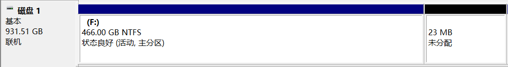
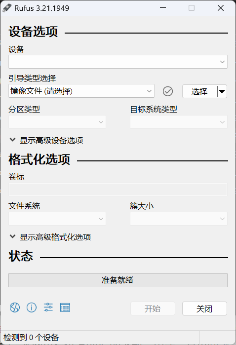
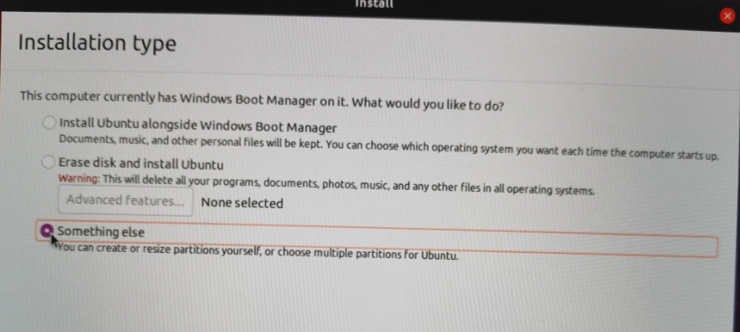
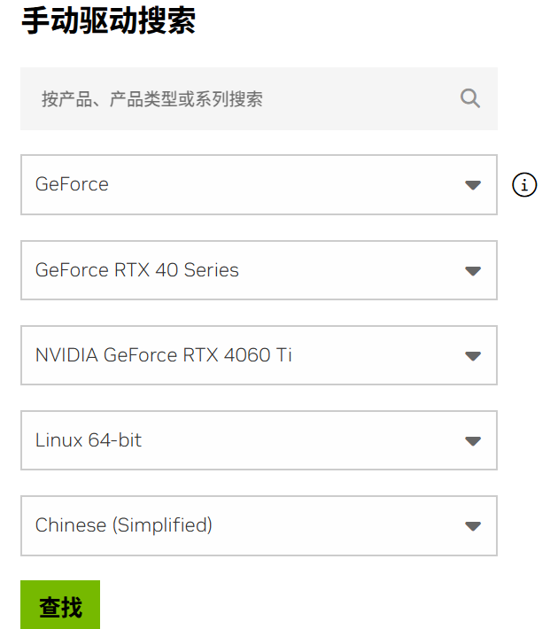
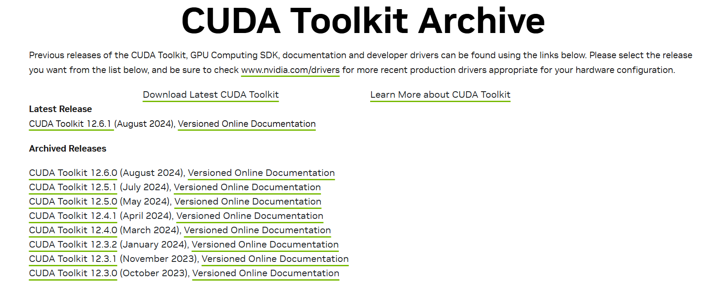
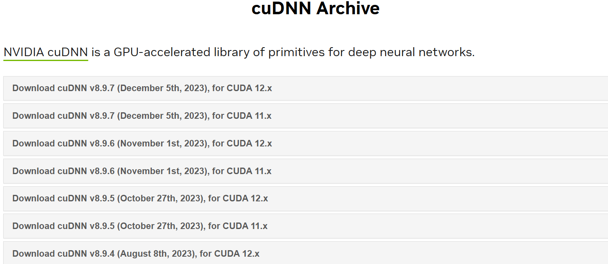
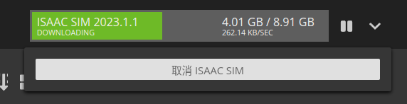

## Windows 系统上安装 Ubuntu 双系统、准备深度学习环境、下载安装 Isaac Sim 与 OmniDrones

下面以我安装 Ubuntu20.04 + 535.183版本显卡驱动 + CUDA12.2 + cuDNN8.9.4 为例：

1. #### **进行磁盘管理**

   ​		使用windows自带的磁盘管理工具或者第三方工具如DiskGenius（[DiskGenius下载链接][1]），可以通过压缩没有使用的硬盘空间，为Ubuntu系统留出足够的未分配硬盘空间。这里我为Ubuntu20.04准备了250G的未分配空间。参考：[Ubuntu空间分配参考][2]。

   

2. #### **准备系统盘**

   ​		从ubuntu官网（[Ubuntu Releases][3]）或者其他镜像源下载 ubuntu 20.04版本的iso镜像文件，准备一块8G以上内存的闲置U盘，使用rufus（[rufus下载链接][4]）或其他U盘写入工具下载的iso镜像文件写入U盘中。参考：[Ubuntu引导盘][5]。

   

3. #### **重启计算机安装ubuntu**

   ​		重启时先进入bios设置，不同厂商的主板进入bios的快捷键不同，可能是F2、F10、Ees、Del等按键，进入bios后设置为U盘启动（重启找不到U盘需要关闭快速启动，有时需要bios设置中找到并关闭secure mode，避免找不到ubuntu系统）。参考：[U盘启动系统设置参考][6]。

4. #### **为ubuntu进行磁盘分区**

   ​		安装过程中选择安装类型：其他。进入分区页面，对未分配的磁盘空间进行分区，常用的分区包括：系统引导分区/boot(或者/efi) (300-500M)、交换分区/swap(1到2倍内存空间)、根挂载区/(软件安装位置，考虑到CUDA、pytorch等的安装建议大于50G)、用户分区/home(存储数据，也是越大越好)。分区完成后选择boot loader安装位置为系统引导分区/boot(或者/efi)的磁盘位置。之后完成ubuntu安装：[ubuntu分区方案 ][7]。



5. #### **保证网络连接**

   ​		以我的计算机为例，<u>没有无线网卡，只能拨号上网，需要手动添加网络设置</u>，参考：[Ubuntu20.04拨号上网][8]。

   > 1. Ctrl+Alt+T 打开终端并键入：
   >
   >    ```python
   >    nm-connection-editor
   >    ```
   >
   > 2. 添加DSL/PPPoE类型的连接，修改Parent interface为**有线网卡**、设置Username和Password、保存、重启

6. #### （可选）**Ubuntu中安装Clash**

   ​		参考：[Ubuntu中Clash配置与可视化][9]。

7. #### **使用apt安装（推荐） 或者 手动安装指定版本的Nvidia驱动（手动安装一直无法启动isaac sim）**

         使用 apt 安装驱动： 在 Ubuntu 上，NVIDIA 驱动通常可以通过包管理器安装。例如：
   
   > - ```python
   >   sudo apt update
   >   sudo apt install nvidia-driver-535
   >   # 这里 nvidia-driver-535 是你当前要安装的驱动版本。你可以根据需要安装不同版本的驱动（例如 nvidia-driver-530）。
   >   ```

   ​		我这里从官网选择了535.183版本，下载前需要先禁用nouveau驱动，否则安装驱动会发生冲突，参考：[.run文件安装nvidia显卡驱动][10]。

   > - 1. 禁用nouveau驱动步骤：
   >
   > - ```python
   >   # 1.编辑文件blacklist.conf：
   >   sudo gedit /etc/modprobe.d/blacklist.conf	
   >   # 2.在文件最后部分插入以下两行内容
   >   blacklist nouveau
   >   options nouveau modeset=0
   >   # 3.更新系统
   >   sudo update-initramfs -u
   >   # 4.重启后验证nouveau是否已禁用，无返回信息表示已禁用
   >   lsmod | grep nouveau
   >   ```
   >
   > - 2. Nvidia官网上（[下载 NVIDIA 官方驱动 | NVIDIA][11]）根据显卡类型筛选并需要选择的驱动版本：
   >
   > - 
   >
   > - 3. 安装驱动：
   >
   > - ```python
   >   # 1.如果之前装过Nvidia驱动，则要卸载掉所有驱动：
   >   sudo apt-get remove nvidia-*  
   >   # 2.给驱动run文件赋予执行权限：
   >   sudo chmod  a+x NVIDIA-Linux-x86_64-535.183.run
   >   # 3.安装驱动,同时关闭X服务、禁用nouveau、不安装OpenGL文件，
   >   # 且在安装时选择不安装32-bit compatibility libraries
   >   sudo ./NVIDIA-Linux-x86_64-535.183.run -no-x-check -no-nouveau-check -no-opengl-files 
   >   ```
   >
   > - 4. 检查驱动：
   >
   > - ```python
   >   # 1.挂载NVIDIA驱动
   >   modprobe nvidia
   >   # 2.检查驱动是否安装成功
   >   nvidia-smi
   >   # 3.安装成功则重启系统
   >   sudo reboot
   >   ```

9. #### **下载CUDA.run**

   ​		这里<u>安装CUDA对 Ubuntu系统的 / 分区大小有要求，空间不能太小否则无法安装且无法删除其他文件，这里最终只能重装系统解决</u>。从官网（[CUDA Toolkit Archive | NVIDIA Developer][12]）下载指定版本的.run文件（此处为CUDA 12.2），其中CUDA版本应当满足驱动版本的要求，具体版本要求见参考：[cuda和显卡驱动对应版本关系][13]。

   

   >```python
   ># 获取指定的CUDA12.2的.run文件 这里推荐使用12.1!!!!!若使用12.1或其他版本需要从官网找到run的下载步骤
   >wget https://developer.download.nvidia.com/compute/cuda/12.2.0/local_installers/cuda_12.2.0_535.54.03_linux.run 
   >```

10. #### **手动安装.run安装包的CUDA**

   ​		之所以选择.run文件是由于，手动安装可以保证原本已经安装的驱动仍按存在。否则<u>使用.deb安装时原本的驱动会被卸载而CUDA自带的驱动包安装不上</u>，安装.run的步骤见参考[.run文件安装12.2版本的cuda][14]。

   >按照参考这里需要关闭图像界面重启再安装，我没有关闭图像界面也可以顺利安装
   >
   >```python
   ># 安装下载的驱动之前需要更新现有包，依次执行：
   >sudo apt update
   >sudo apt upgrade
   >sudo apt install build-essential dkms
   >sudo apt install linux-headers-$(uname -r)
   >sudo sh cuda_12.2.0_535.54.03_linux.run
   >```
   >
   >安装时注意去掉安装显卡驱动的选项，否则驱动冲突会安装失败
   >
   >```python
   ># 1.配置CUDA的环境变量
   >sudo gedit ~/.bashrc
   ># 2.然后查看/usr/local中的cuda版本，这里下载的是cuda-12.2
   ># 3.添加环境变量
   >export PATH=/usr/local/cuda-12.2/bin${PATH:+:${PATH}}
   >export LD_LIBRARY_PATH=/usr/local/cuda-12.2/lib64${LD_LIBRARY_PATH:+:${LD_LIBRARY_PATH}}
   ># 4.使修改后的环境变量生效
   >source ~/.bashrc
   ># 5.检查CUDA是否安装成功，有版本信息则安装成功
   >nvcc -V
   >```

11. #### **安装cuDNN**

    ​		注册且登录Nvidia账号，从官网下载满足CUDA需求的cuDNN版本（[cuDNN Archive | NVIDIA Developer][15]）。

    

    >```python
    ># 1.解压cuDNN的.tar.xz文件
    ># 2.复制到CUDA路径下并给予读权限，/usr/local/cuda路径是软链接，如果存在多个cuda版本 可以指定为具体版本路径如/usr/local/cuda-12.1
    >sudo cp cuda/include/* -R /usr/local/cuda/include/ 
    >sudo cp cuda/lib64/libcudnn* /usr/local/cuda/lib64/ 
    >sudo chmod a+r /usr/local/cuda/include/cudnn.h 
    >sudo chmod a+r /usr/local/cuda/lib64/libcudnn*
    ># 3.测试，返回头文件的定义信息表示安装成功
    >cat /usr/local/cuda/include/cudnn_version.h | grep CUDNN_MAJOR -A 2
    >```

12. #### **安装 Anaconda 与 VS code**

    ​		分别从 [Download Anaconda][16] 和 [Visual Studio Code][17] 中下载并安装。安装完成后配置conda环境 [ubuntu安装Conda][18]：

    > ```python
    > # 1.查看环境配置中是否有conda路径
    > sudo gedit ~/.bashrc
    > # 2.若没有则添加conda路径
    > export PATH="/path/to/anaconda3_or_miniconda3/bin:$PATH"
    > # 3.更改环境配置
    > source ~/.bashrc
    > ```

13. #### **从Nvidia官网链接注册并下载Omniverse平台**

    ​		官网链接与安装步骤：[Download Omniverse Launcher][19]。

14. #### **按照官网步骤安装 Omniverse Launcher、Cache、Nucleus**

    ​		官网链接中有安装步骤：[Omniverse IsaacSim 官方文档][20]。其中<u>Nvidia Omniverse Launcher登录时遇到网络问题，关闭防火墙后reboot解决</u>。

15. #### **从 Omniverse Launcher 中安装 Isaac Sim** 

    ​		这里下载似乎有限速，安装缓慢，1天没有装完，暂时没找到Ubuntu下快速安装的方法：

    

          这里可以参考[21]https://blog.csdn.net/qq_42864343/article/details/131728784 todo 修改引用格式


[1]:https://www.diskgenius.com/	"DiskGenius下载链接"
[2]:https://blog.csdn.net/jy15246781299/article/details/133667186	"Ubuntu空间分配参考"
[3]:https://releases.ubuntu.com/	"Ubuntu Releases"
[4]:https://rufus.ie/downloads/	"rufus下载链接"
[5]:https://blog.csdn.net/jy15246781299/article/details/133667186	"Ubuntu引导盘"
[6]:https://blog.csdn.net/qq_42313591/article/details/136007211	"U盘启动系统设置参考"
[7]:https://blog.csdn.net/qq_35724582/article/details/125729026	"ubuntu分区方案"
[8]:https://www.cnblogs.com/FaithALL/p/13268058.html	"Ubuntu20.04拨号上网"
[9]:https://zhuanlan.zhihu.com/p/2852384493	"Ubuntu中Clash配置与可视化"
[10]:https://zhuanlan.zhihu.com/p/688305108	".run文件安装nvidia显卡驱动"
[11]:https://www.nvidia.cn/drivers/lookup/	"下载 NVIDIA 官方驱动 | NVIDIA"
[12]:https://developer.nvidia.com/cuda-toolkit-archive	"CUDA Toolkit Archive | NVIDIA Developer"
[13]:https://blog.csdn.net/FL1623863129/article/details/137070923	"cuda和显卡驱动对应版本关系"
[14]:https://blog.csdn.net/qq_42864343/article/details/131728784	".run文件安装12.2版本的cuda"
[15]:https://developer.nvidia.com/rdp/cudnn-archive	"cuDNN Archive | NVIDIA Developer"
[16]:https://www.anaconda.com/download/success	"Download Anaconda"
[17]:https://code.visualstudio.com/Download	"Visual Studio Code"
[18]:https://blog.csdn.net/marsjin/article/details/139806830	"ubuntu安装Conda"
[19]:https://www.nvidia.com/en-us/omniverse/download/	"Download Omniverse Launcher"
[20]:https://docs.omniverse.nvidia.com/isaacsim/latest/installation/install_workstation.html	"Omniverse IsaacSim 官方文档"
[21]:https://blog.csdn.net/sebrina111007/article/details/143231385	"包含Isaac Sim下载太慢解决方法"
